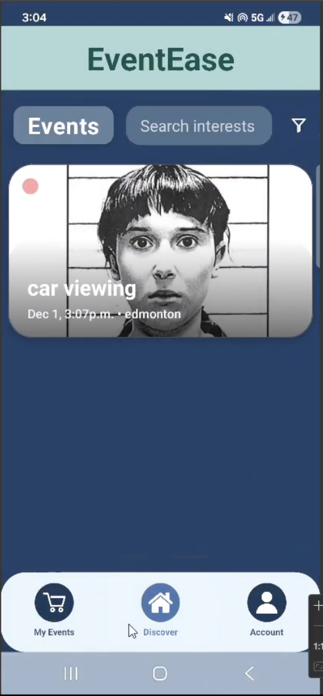
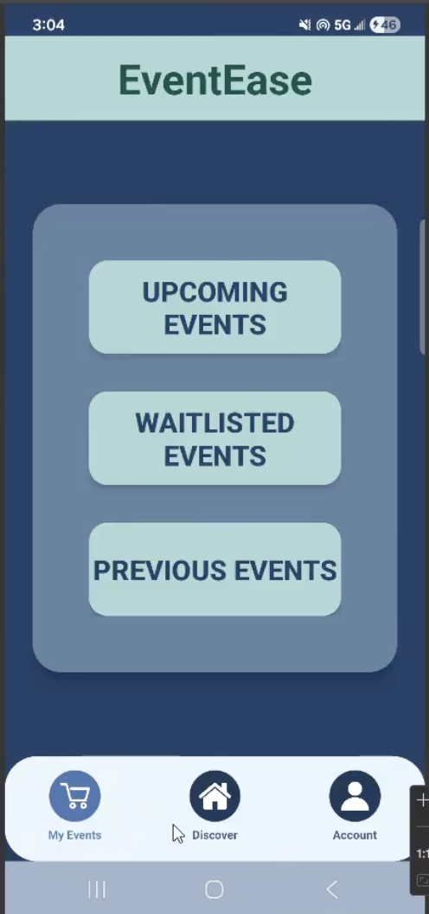
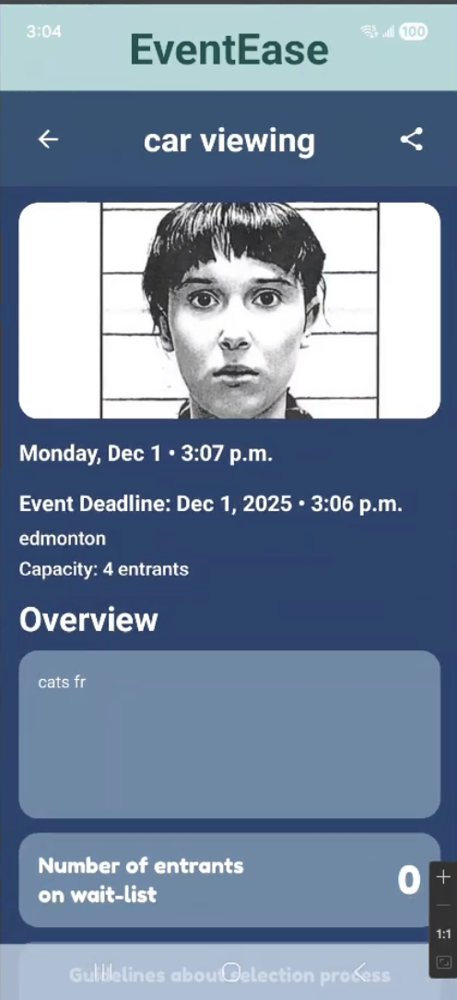
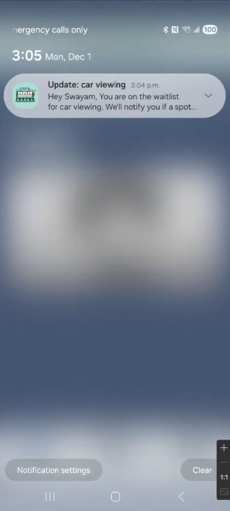
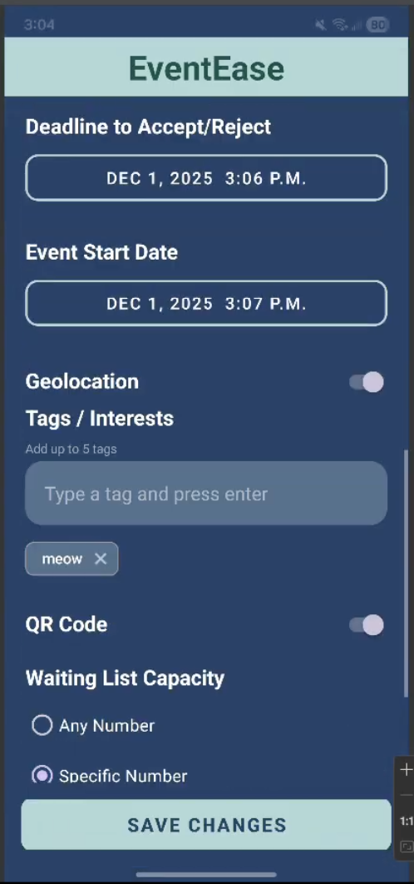
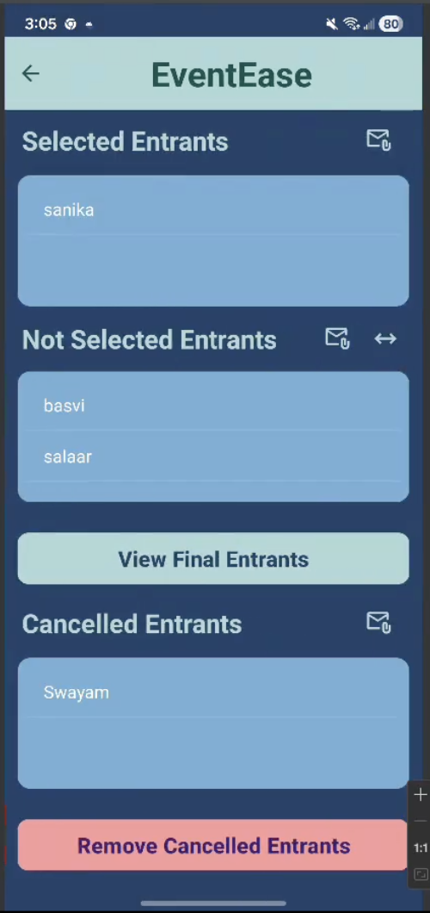

# EventEase – Event Management & Discovery Platform

<div align="center">
  
  **A comprehensive mobile event management system connecting organizers and attendees through smart waitlists, automatic selections, and real-time notifications.**
  
  [](https://developer.android.com/)
  [](https://firebase.google.com/)
  [](https://developers.google.com/maps)
  [](https://www.java.com/)
</div>

---

## 📖 About

**EventEase** bridges the gap between event organizers and attendees by providing a seamless platform for event discovery, registration management, and communication. Whether you're organizing a local meetup or attending concerts, EventEase handles the complexity of waitlists, capacity management, and attendee selection—all through an intuitive mobile interface.

The app empowers **organizers** to create events with custom capacity limits, manage waitlists intelligently, and track attendee locations for verification. **Attendees** can discover nearby events, join waitlists with a single tap, and receive real-time notifications about their registration status—from selection to admission.

Built with Firebase's real-time capabilities and Android's modern UI toolkit, EventEase delivers a robust, scalable solution for event management.

---

## ✨ Features

### 👥 **For Attendees**

#### 🔍 Event Discovery & Registration
- Browse events with rich information cards displaying titles, dates, locations, and custom posters
- Join waitlists instantly with real-time capacity and waitlist count updates
- Track your event journey through multiple states: waitlisted, selected, admitted, or cancelled

#### 📬 Smart Notifications & Invitations
- Receive push notifications when selected from a waitlist
- Accept or decline invitations within organizer-defined deadlines
- Get automatic "sorry" notifications if not selected or if deadlines are missed
- Tap notifications to jump directly to relevant event details

#### 📱 Personalized Dashboard
- View all your events categorized as: Upcoming, Previous, and Invited
- See invitation status and respond directly from the event detail screen
- Track event guidelines, notes, and important dates

### 🎯 **For Organizers**

#### ⚙️ Event Creation & Management
- Create events with detailed configurations:
  - Set event capacity and sample size for selections
  - Define registration windows and selection deadlines
  - Upload custom event posters from device or camera
  - Add event guidelines, location details, and special notes

#### 📊 Intelligent Waitlist Management
- View all entrants organized by status: Waitlisted, Selected, Admitted, Cancelled, Non-Selected
- Run automatic lottery-based selection from waitlists
- Manually select replacement entrants when spots open up
- Respect capacity constraints and sampling rules automatically

#### 🗺️ Location Tracking & Verification
- View waitlisted attendees on an interactive Google Map
- See geolocation data for attendees who granted location permissions
- Verify attendee proximity for location-restricted events

#### 🤖 Automated Backend Operations
- Cloud Functions handle automatic selections at deadline times
- Send batch notifications to selected, cancelled, and non-selected entrants
- Replace declined/cancelled attendees automatically from the waitlist

### 🔐 **Security & Onboarding**

#### 📋 Seamless First-Time Experience
- Device-based authentication keeps users signed in
- Guided profile setup with profile picture upload
- Clear permission requests for location and notifications with explanations

#### 🔔 Permission Management
- Optional location sharing for event discovery and organizer verification
- Push notification opt-in with clear value proposition
- Staged permission requests that respect user choice

---

## 🎨 Screenshots

| 🏠 **Event Discovery** | 📅 **My Events** | 🎫 **Event Details** |
|------------------------|------------------|----------------------|
|  |  |  |
| *Browse and discover upcoming events with rich cards* | *Track all your registered and invited events* | *View detailed event information and RSVPs* |

| 📬 **Invitation** | ⚙️ **Create Event** | 🗺️ **Waitlist** |
|-------------------|---------------------|---------------------|
|  |  |  |
| *Accept or decline event invitations* | *Set up events with custom configurations* | *View waitlist* |

---

## 🏗️ Architecture & Technology Stack

### **Frontend**
- **Platform**: Native Android (Java)
- **UI Framework**: AndroidX, Material Design Components
- **Navigation**: Fragment-based architecture with Bottom Navigation
- **Image Loading**: Glide for efficient image caching and loading

### **Backend & Services**
- **Authentication**: Firebase Authentication (Email/Password, Device-based)
- **Database**: Cloud Firestore (Real-time NoSQL database)
- **Storage**: Firebase Storage (Event posters, profile pictures)
- **Serverless Functions**: Cloud Functions for Firebase (Node.js)
  - Automatic entrant selection at deadlines
  - Batch notification processing
  - Event state management

### **Integrations**
- **Maps**: Google Maps SDK for Android
- **Location**: Fused Location Provider API
- **Notifications**: Firebase Cloud Messaging (FCM) with notification channels
- **Deep Linking**: Android App Links for notification navigation

### **Design Patterns**
- Repository pattern for data access
- Observer pattern for real-time updates
- Singleton pattern for service managers
- MVVM-inspired architecture

---

## 🚀 Getting Started

### Prerequisites

- **Android Studio** (Arctic Fox or later)
- **JDK 11** or higher
- **Android SDK** (API 24+)
- **Firebase Account** (free tier works)
- **Google Cloud Account** (for Maps API)

### 1. Clone the Repository

```bash
git clone https://github.com/MuhammadZain2005/EventEase.git
cd EventEase
```

### 2. Firebase Setup

1. **Create Firebase Project**
   - Go to [Firebase Console](https://console.firebase.google.com/)
   - Click "Add Project" and follow the setup wizard
   - Choose a project name (e.g., "EventEase")

2. **Register Android App**
   - In Project Settings → Your Apps → Add App → Android
   - Package name: `com.example.eventease`
   - Download `google-services.json`
   - Place it at: `code/EventEase/app/google-services.json`

3. **Enable Firebase Products**
   - **Authentication**: Enable Email/Password provider
   - **Firestore Database**: Create database in production mode
   - **Storage**: Set up default bucket
   - **Cloud Messaging**: Enabled by default

4. **Configure Security Rules**
   - Copy the provided `firestore.rules` from `code/EventEase/firestore.rules`
   - Paste into Firestore Rules editor in Firebase Console
   - Do the same for `storage.rules`

5. **Deploy Cloud Functions (Optional)**
   ```bash
   cd code/EventEase/functions
   npm install
   firebase login
   firebase deploy --only functions
   ```

### 3. Google Maps Configuration

1. **Get Debug SHA-1 Certificate**
   ```bash
   keytool -list -v \
     -keystore ~/.android/debug.keystore \
     -alias androiddebugkey \
     -storepass android -keypass android | grep SHA1
   ```

2. **Create Maps API Key**
   - Go to [Google Cloud Console](https://console.cloud.google.com/)
   - Navigate to APIs & Services → Credentials
   - Create API Key or use existing one
   - Enable **Maps SDK for Android**

3. **Restrict API Key**
   - Add Android application restriction:
     - Package name: `com.example.eventease`
     - SHA-1 certificate: Your debug SHA-1 from step 1
   - Restrict to **Maps SDK for Android** API

4. **Add to Local Properties**
   - Open/create `code/EventEase/local.properties`
   - Add the following lines:
   ```properties
   sdk.dir=/path/to/your/Android/sdk
   google.maps.api.key=YOUR_GOOGLE_MAPS_API_KEY_HERE
   ```

### 4. Build and Run

1. Open the project in **Android Studio**
2. Wait for Gradle sync to complete
3. Connect an Android device or start an emulator
4. Click **Run** (▶️) or press `Shift + F10`
5. Select your target device and wait for installation

---

## 📱 Key User Flows

### **Attendee Journey**

1. **Onboarding**
   - First launch → Welcome screen
   - Device authentication setup
   - Profile creation with optional picture upload
   - Permission requests (location & notifications)

2. **Discovering Events**
   - Browse event feed on Discover tab
   - Filter by date, location, or category
   - View event details with poster and guidelines

3. **Joining & Tracking**
   - Tap "Join Waitlist" on event detail page
   - Receive confirmation and waitlist position
   - Track status in "My Events" tab
   - Get notified when selected

4. **Responding to Invitations**
   - Receive push notification
   - Tap to open invitation detail
   - Accept or decline within deadline
   - Receive confirmation notification

### **Organizer Journey**

1. **Creating Events**
   - Navigate to Organizer section
   - Fill in event details (title, date, location)
   - Upload event poster
   - Set capacity, sample size, and deadlines
   - Add guidelines and notes

2. **Managing Registrations**
   - View waitlist with real-time count
   - Run automatic selection lottery
   - Manually replace cancelled attendees
   - Track admitted vs. cancelled vs. pending

3. **Monitoring Attendees**
   - Open attendee location map
   - Verify proximity for location-based events
   - Export attendee lists (if needed)

---

## 🗂️ Project Structure

```
EventEase/
├── code/
│   └── EventEase/
│       ├── app/
│       │   ├── src/
│       │   │   ├── main/
│       │   │   │   ├── java/com/example/eventease/
│       │   │   │   │   ├── activities/       # UI screens
│       │   │   │   │   ├── adapters/        # RecyclerView adapters
│       │   │   │   │   ├── fragments/       # Fragment classes
│       │   │   │   │   ├── models/          # Data models
│       │   │   │   │   ├── services/        # Background services
│       │   │   │   │   └── utils/           # Helper classes
│       │   │   │   ├── res/                 # Resources
│       │   │   │   └── AndroidManifest.xml
│       │   └── google-services.json         # Firebase config
│       ├── functions/                        # Cloud Functions
│       ├── firestore.rules                   # Firestore security
│       └── storage.rules                     # Storage security
├── doc/                                      # Documentation
└── README.md
```

---
## 📚 Documentation

- **[Wiki](https://github.com/RISCVI-301/CMPUT301F25riscvi/wiki)** - Comprehensive project documentation
- **[UI Mockups](https://github.com/RISCVI-301/CMPUT301F25riscvi/wiki/Updated-UI-Mockup-(PART-4))** - Design prototypes and wireframes
- **[Storyboard](https://github.com/RISCVI-301/CMPUT301F25riscvi/wiki/Updated-Storyboard-Sequence-(PART-4))** - User flow sequences
- **[UML Diagrams](https://github.com/RISCVI-301/CMPUT301F25riscvi/wiki/Final-UML-Class-Diagram-Based-on-CodeBase)** - System architecture
- **[Sprint Planning](https://github.com/RISCVI-301/CMPUT301F25riscvi/wiki/Sprint-Planning-and-Review)** - Development timeline

---

## 👥 Team RISCVI

| Name | Role | GitHub |
|------|------|--------|
| **Muhammad Zain Asad** | Lead Developer | [@MuhammadZain2005](https://github.com/MuhammadZain2005) |
| **Affan Nazir** | Backend Developer | [@M-Affan-Nazir](https://github.com/M-Affan-Nazir) |
| **Muhammad Salaar Butt** | Android Developer | [@msbutt1](https://github.com/msbutt1) |
| **Basvi Chunara** | UI/UX Designer | [@basviyog](https://github.com/basviyog) |
| **Sanika Verma** | QA Engineer | [@SanikaVerma](https://github.com/SanikaVerma) |
| **Swayam Sagar** | DevOps | [@Swayam1129](https://github.com/Swayam1129) |

---

## 🤝 Contributing

This project was developed as part of CMPUT 301 (Fall 2025) at the University of Alberta. While the main development is complete, we welcome feedback and suggestions!

1. Fork the repository
2. Create a feature branch (`git checkout -b feature/AmazingFeature`)
3. Commit your changes (`git commit -m 'Add some AmazingFeature'`)
4. Push to the branch (`git push origin feature/AmazingFeature`)
5. Open a Pull Request

---

## 🙏 Acknowledgments

- **University of Alberta** - CMPUT 301 Course Staff
- **Firebase** - For providing robust backend infrastructure
- **Google Maps Platform** - For location services and mapping
- **Material Design** - For UI component guidelines
- **AndroidX** - For modern Android development tools


<div align="center">
  Made with ❤️ by Team RISCVI
</div>
